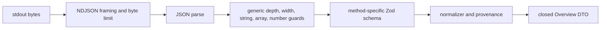

# Codex Adapter Architecture

**Status:** Phase 2 account and quota reads implemented  
**Last updated:** August 14, 2026 at 11:16 AM EDT

## Boundary

The adapter is Token Trail's most sensitive module. It converts a broad experimental local protocol into a small reviewed read-only capability. Protocol availability never grants application authorization automatically.

## Outbound authorization

The closed request allowlist contains initialization, account read, rate-limit read, and the approved Phase 3 aggregate-usage read. The latter is not called by Phase 2. Rate-limit updates live in an independently closed notification allowlist.

Every request method is checked at runtime immediately before serialization, even though TypeScript also restricts trusted callers. Renderer input cannot select a method or supply params.

## Transport framing and correlation

- The child communicates through newline-delimited JSON over owned stdio pipes.
- Token Trail creates monotonically increasing safe-integer request IDs.
- A pending map correlates each ID with one resolver, rejecter, and timeout.
- Undefined optional params are omitted because JSON has no `undefined` representation.
- Unknown response IDs and unapproved notifications are ignored.
- Oversized, malformed, deeply nested, wide, or unsafe-number input fails the connection with a sanitized category.

## Validation pipeline

Generic guards protect the parser boundary from resource abuse. Method schemas then retain only approved fields. For example, the account schema strips email, and quota schemas strip future unknown fields. The renderer never sees the initialization result or raw envelopes.

## Normalization rules

- Reported values keep `reported` provenance.
- Remaining percentage is calculated only from a valid used percentage and receives `calculated` provenance.
- Local observation timestamps receive `observed` provenance.
- Null, missing, invalid, unsafe, or out-of-range values produce explicit unavailable values.
- Multi-bucket responses retain every validated bucket and do not silently collapse secondary capacity.
- Signed-out account state avoids an unnecessary quota request.

## Compatibility policy

Initialization must match the narrow non-identifying compatibility schema. A missing approved method produces `codex-incompatible`; missing executable or process exit produces an unavailable category; malformed shapes produce `invalid-response`. No raw upstream error message crosses the privileged boundary.

The installed `codex-cli 0.146.1` was probed through the same read-only methods with privacy-safe output. Because the app-server is experimental, fixtures and runtime validation remain the source of application confidence rather than version-number assumptions.

## Explicit denials

The adapter does not read prompts, responses, tasks, turns, repositories, files, tool calls, environment values, or credentials. It performs no login, logout, reset-credit consumption, feedback, mutation, task control, or shell command selected by protocol or renderer data.
