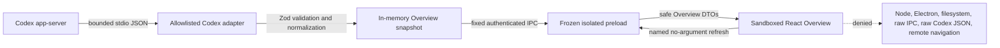
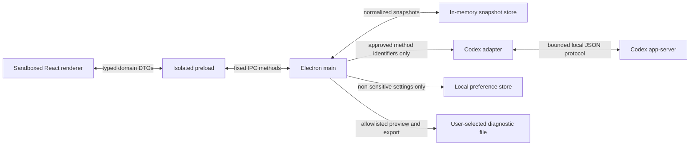

# Token Trail Data Flow

**Status:** Phase 2 vertical slice implemented
**Last updated:** August 14, 2026 at 11:01 AM EDT

## Current Phase 2 flow

The Phase 2 application reads only approved account and rate-limit state, holds normalized snapshots in memory, and displays them read-only. It still has no preference persistence, diagnostic export, telemetry, or update request.

## Planned approved v1 flow

## Boundary rules

1. The Codex adapter validates protocol data before normalization.
2. The main process sends domain DTOs, not raw protocol objects, through fixed IPC handlers.
3. Preload exposes individual functions, not channel names or generic message functions.
4. The renderer never receives credentials, subprocess handles, filesystem paths, environment variables, or raw errors.
5. Usage snapshots and current-session changes stay in memory and disappear at process exit.
6. Preferences contain only validated non-sensitive user choices.
7. Diagnostic export constructs an allowlisted safe object and shows it before writing.
8. Normal v1 operation sends no Token Trail telemetry.

## Future network boundary

GitHub Releases is the fixed planned distribution provider. v1 preview uses manual downloads. Any application-initiated update request remains disabled until a separate network and consent decision is approved.
