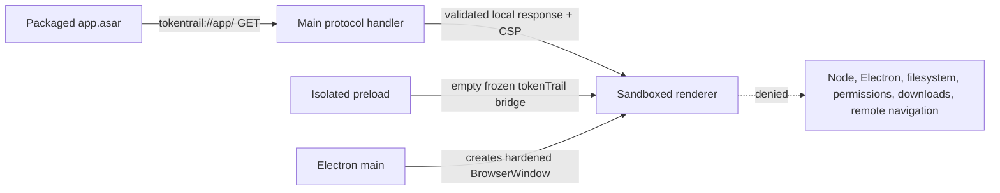
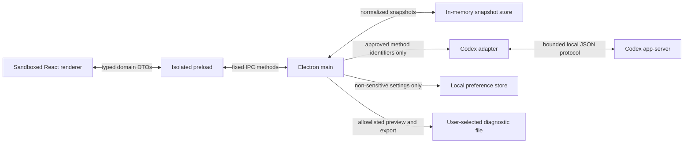

# TokenTrail Data Flow

**Status:** Phase 1 foundation baseline
**Last updated:** August 14, 2026

## Phase 1 flow

The Phase 1 application displays only bundled branding and static foundation text. It has no Codex transport, account snapshot, preference storage, diagnostic export, telemetry, or update request.

## Planned approved v1 flow

## Boundary rules

1. The Codex adapter validates protocol data before normalization.
2. The main process sends domain DTOs, not raw protocol objects, through fixed IPC handlers.
3. Preload exposes individual functions, not channel names or generic message functions.
4. The renderer never receives credentials, subprocess handles, filesystem paths, environment variables, or raw errors.
5. Usage snapshots and current-session changes stay in memory and disappear at process exit.
6. Preferences contain only validated non-sensitive user choices.
7. Diagnostic export constructs an allowlisted safe object and shows it before writing.
8. Normal v1 operation sends no TokenTrail telemetry.

## Future network boundary

GitHub Releases is the fixed planned distribution provider. v1 preview uses manual downloads. Any application-initiated update request remains disabled until a separate network and consent decision is approved.
