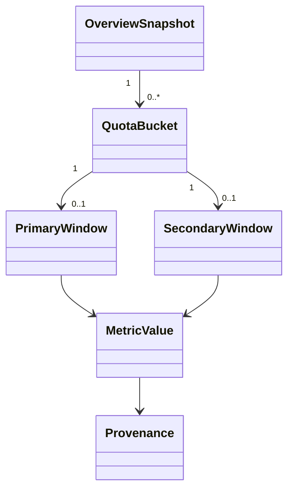

# Domain Model and Provenance

**Status:** Phase 3 complete domain vocabulary implemented
**Last updated:** August 21, 2026

## Purpose

The domain model is the vocabulary Token Trail trusts after raw protocol validation. It prevents renderer components from depending on experimental Codex envelopes and requires every visible metric to explain where it came from.

## Current model

An Overview snapshot contains state, minimal non-identifying account context, normalized quota buckets, refresh timestamps, partial-state information, and one closed error category. Each bucket has safe identity/display metadata and independently optional primary and secondary windows.

## Metric value states

A metric is not represented as an unqualified number. It carries either a valid value and provenance or an explicit unavailable condition. This preserves distinctions among:

- a reported zero;
- a missing field;
- an explicit null;
- a rejected invalid or unsafe value;
- a field unsupported by the current server.

Those distinctions are necessary for honest calculations, accessibility text, diagnostics, and future comparisons.

## Provenance

| Provenance | Meaning | Current examples |
| --- | --- | --- |
| `reported` | Directly supplied by validated Codex data | Used percentage, duration, reset timestamp |
| `calculated` | Deterministically derived by Token Trail | Remaining percentage, reset countdown |
| `observed` | Recorded from the local application environment | Refresh attempt and success timestamps |

Calculated values retain their source dependency. Remaining percentage exists only when used percentage is valid and bounded. Countdown exists only when a valid reset timestamp exists. Token Trail never combines unlike units or converts token activity into quota percentage.

## Boundary conversion

Protocol schemas retain only approved fields and strip email and unknown keys. Normalization performs field-level validation, deduplicates or selects bucket sources deterministically, constructs availability-aware windows, and produces a runtime-validated snapshot. No raw protocol object is stored alongside the domain value.

## Identity and privacy

The renderer may receive a broad account kind and bounded plan label needed for presentation. It does not receive email, credential state beyond signed-in requirements, account IDs, request IDs, reset-credit identifiers, paths, or unknown future fields.

## Extension rule

Usage, credits, reset-credit details, coverage, session baselines, preferences, diagnostics, and sanitized health counters now have their own closed contracts under `src/shared/contracts/`. Before adding a field in the future, update the data inventory with source, purpose, lifetime, renderer exposure, persistence, and diagnostic treatment. Precision-sensitive integer or decimal values must not pass through unsafe JavaScript number conversion; aggregate counters cross boundaries as canonical decimal strings.

Detailed implemented calculations live in `calculations-and-precision.md`. This document remains the shared vocabulary and provenance authority rather than duplicating every formula.

## Evidence and limitations

Unit fixtures cover valid, null, missing, invalid, multiple-bucket, unknown-field, credit-state, usage-bucket, duplicate-date, and beyond-safe-range inputs through the section 21.2 catalog. React tests verify explicit unavailable text and provenance labels on every route.
