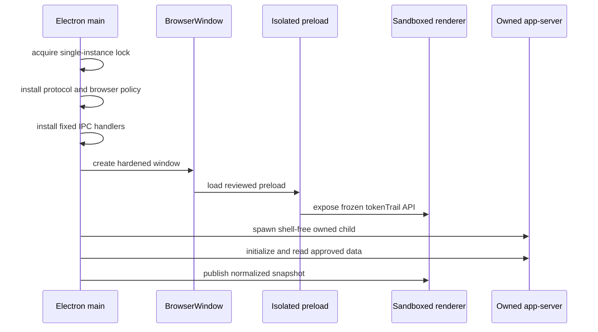

# Process and Lifecycle Architecture

**Status:** Phase 2 implemented behavior  
**Last updated:** August 14, 2026 at 11:16 AM EDT

## Process ownership

Token Trail uses Electron's main, preload, and renderer boundaries plus one optional Codex child. The main process is the only owner of operating-system and subprocess capabilities.

## Startup order

1. Register the secure custom scheme before Electron becomes ready.
2. Set the human-facing application name independently from the executable slug.
3. Enable Chromium sandboxing and acquire the single-instance lock.
4. After readiness, install the local protocol and deny-by-default web-content policy.
5. Install IPC before the renderer can request its first snapshot.
6. Create one hardened window.
7. Begin the initial Overview refresh only after the secure boundaries exist.

The main window uses sandboxing and context isolation with Node integration, webviews, and unsafe module access disabled. Unexpected navigation, popups, permissions, and downloads are denied globally.

## Codex child ownership

- Discovery considers only absolute `PATH` directories and invokes no shell.
- Production arguments are fixed to the reviewed app-server stdio mode.
- The environment is rebuilt from an allowlist rather than inherited wholesale.
- Main retains the exact child handle and never searches for or terminates unrelated processes.
- Stderr is drained and discarded because it may contain paths or identifiers.
- Every pending request has a timer and is rejected with a safe category during exit or shutdown.

## Failure and recovery

A failed connection is stopped and discarded. Consecutive failures produce capped exponential delays. The restart budget prevents tight loops, while expiry of the maximum cooldown permits one recovery attempt so the circuit does not lock permanently.

During a transient failure after a successful read, the controller retains the prior snapshot and marks it stale. Before any success, it selects unsupported, unavailable, or error from a closed category set.

## Shutdown

The `before-quit` path removes IPC handlers, stops the controller, removes notification listeners, rejects pending requests, and signals only the owned child. Cleanup is idempotent.

Development testing has a separate orchestrator lifecycle. The harness starts `scripts/dev.mjs` directly so that one retained orchestrator owns Vite watchers, the renderer server, and Electron. This avoids the orphan risk observed when a test terminated an npm wrapper instead of the actual owner.

## Tests

Unit tests cover deduplication, stale preservation, retry delays, restart budget, and recovery. Integration fixtures cover timeout, cancellation, malformed data, oversized output, and process exit. Packaged tests use a disposable profile and isolated `PATH`/`HOME`, preventing accidental discovery of a real Codex installation.
