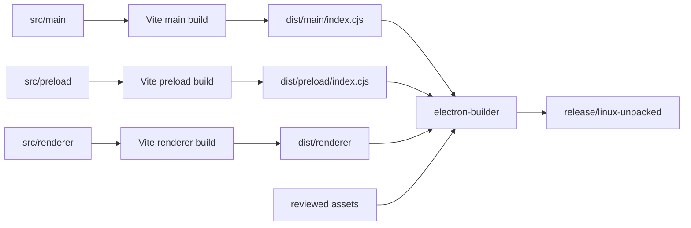

# Repository and Build System

**Status:** Phase 2 implemented behavior
**Last updated:** August 14, 2026 at 11:28 AM EDT

## Purpose

This document explains how authored source becomes development processes, production bundles, tests, and a local packaged directory. It describes the current build only; release publishing remains Phase 5.

## Repository responsibilities

| Path | Responsibility |
| --- | --- |
| `src/main/` | Privileged Electron orchestration, Codex adapter, security policy, IPC, and window lifecycle |
| `src/preload/` | Isolated, validated renderer bridge |
| `src/renderer/` | Sandboxed React interface and local styling |
| `src/shared/` | Dependency-light contracts shared across trust boundaries |
| `scripts/` | Maintainer-owned development orchestration |
| `build/` | Shared Vite build configuration helpers |
| `tests/` | Executable test suites, fixtures, helpers, and durable reports |
| `tests/test_reports/` | Reviewed version evidence; not executable test discovery |
| `docs/architecture/` | Implemented-system architecture and phase-timed planned documentation |

## TypeScript projects

Main, preload, renderer, tests, and tooling have separate TypeScript configurations. This prevents browser code from silently acquiring Node assumptions and makes each environment's available types explicit. All projects extend strict shared compiler settings and run under the aggregate type-check command.

## Build graph

Main and preload build to CommonJS because Electron loads those privileged entries directly. Renderer builds as browser assets with no public directory copying, no production source maps, and one imported local icon. The renderer root excludes privileged source directories.

## Development orchestration

`npm run dev` starts `scripts/dev.mjs`. The orchestrator owns main/preload watchers, the fixed-loopback Vite server, and Electron. It waits for every prerequisite before launch and terminates the children it created. Test-only fixture and debugging options are exact allowlisted values and are ignored by packaged execution.

## Package construction

`electron-builder.config.cjs` owns the user-facing product name, machine-safe executable and application identifiers, icon, ASAR layout, Linux target metadata, and fuse application. `package:dir` produces an unpacked local package for evidence; it does not publish or create a GitHub Release.

## Dependency and reproducibility rules

- Runtime and development dependencies are exact or lockfile-resolved according to the documented policy.
- `package-lock.json` is authoritative for frozen CI installation.
- Verification does not rewrite tracked source; formatting is an explicit maintainer action.
- Generated bundles, release directories, coverage, and transient Playwright output are not source architecture.
- New dependencies require a rationale, license/advisory review, and an explanation of why local code is insufficient.

## Failure behavior and evidence

A missing CSP marker, failed Vite build, type error, lint error, or package step fails the command rather than producing a partial success. Phase 2 evidence covers all three builds, development orchestration, built Electron, and the fused unpacked package. Installer formats, multi-architecture CI, checksums, SBOM, signing, and publishing remain Phase 5.
