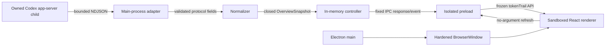

# System Overview

**Status:** Phase 2 implemented behavior  
**Last updated:** August 14, 2026 at 11:16 AM EDT

## Purpose

Token Trail is a local Electron dashboard that explains approved Codex account and quota information. Its central architectural rule is that raw Codex protocol data and desktop privileges never reach the renderer.

## Component map

## Responsibilities

| Component | Owns | Must not own |
| --- | --- | --- |
| Electron main | App/window lifecycle, local protocol, browser policy, IPC, controller | Dashboard markup or arbitrary renderer-selected operations |
| Codex adapter | Executable discovery, child process, request correlation, limits, raw schemas | UI state, persistence, generic protocol forwarding |
| Normalizer | Closed domain conversion and provenance | Raw transport or visual rendering |
| Overview controller | Current snapshot, refresh deduplication, stale preservation, retry budget | Renderer objects or disk storage |
| Preload | Three validated purpose-specific bridge methods | Generic IPC, channel selection, Electron exposure |
| Renderer | Accessible presentation and user refresh intent | Node, filesystem, process, raw protocol, credentials |

## One complete refresh

1. Main creates the hardened window, installs fixed IPC handlers, then requests an initial refresh.
2. The controller starts one owned Codex client when no healthy client exists.
3. The client resolves `codex` from absolute `PATH` entries, launches without a shell, and performs initialization.
4. Main requests `account/read`. A null account becomes a signed-out snapshot and stops the quota flow.
5. For a present account, main requests `account/rateLimits/read`.
6. Generic size/depth/value guards run before narrow Zod schemas.
7. Schemas strip email and unknown fields. The normalizer creates provenance-aware quota objects.
8. The controller stores one validated in-memory snapshot and notifies subscribers.
9. IPC and preload validate the snapshot again before React receives it.
10. React renders the matching state without interpreting raw protocol structures.

## Invariants

- Only closed allowlisted Codex methods can reach transport.
- Missing, invalid, and null data never silently become zero.
- Raw upstream errors are converted to fixed local categories.
- Account and quota values are not persisted.
- The renderer cannot choose a channel, protocol method, path, executable, or payload.
- Automatic periodic refresh is disabled pending evidence.
- A valid sparse update notification triggers a complete approved read rather than an uncertain merge.

## Current limitations

Phase 2 has one route and no preferences, diagnostics export, aggregate usage, release updater, or history. Desktop icon correction, dense numeral spacing, and the remaining v1 routes are scheduled in Phase 3. Final visual assets, broad desktop testing, and memory optimization remain Phase 4.
