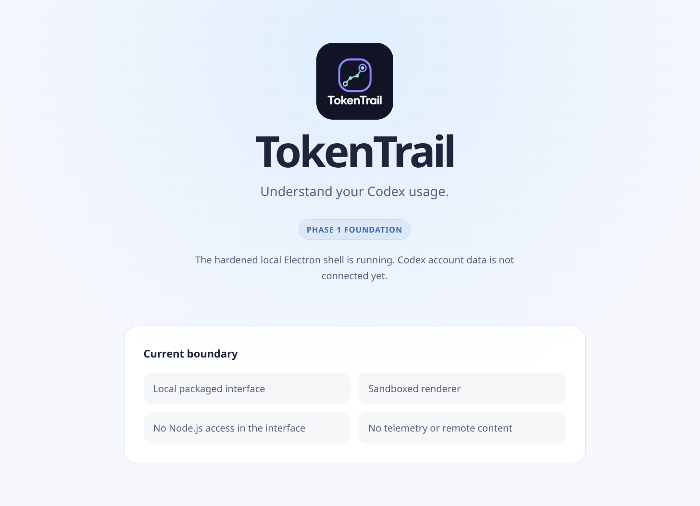

# Token Trail 0.1.0 Phase 1 Test Report

**Report state:** Phase 1 complete; product-name correction recorded for Phase 2
**Test date:** August 14, 2026
**Recommendation:** Not ready for public release; suitable as a reviewed Phase 1 development foundation
**Tested source:** Commit `75bb8f5` (`Complete Phase 1 secure Electron foundation`)

## 1. Purpose

This report records the evidence produced while building Phase 1 of Token Trail. It covers the secure Electron foundation, account-free Codex fixture, branded shell, Linux development package, packaged screenshot, security posture, and baseline performance. It does not claim that the Codex connection or v1 dashboard is implemented.

The report is updated phase by phase. Screenshots are captured from the app under test, visually inspected, and then embedded here. Routine CI screenshots remain transient unless deliberately promoted into this versioned evidence folder.

## 2. Tested build and environment

| Item | Tested value |
| --- | --- |
| Product version | `0.1.0` development foundation |
| Source commit | `75bb8f5206f2f6ff2d9883f4f61c80879d367279` |
| Source state | Committed Phase 1 build; later documentation records the naming correction without altering tested evidence |
| Operating system | CachyOS Linux, kernel `7.1.8-1-cachyos` |
| Architecture | `x86_64` |
| Desktop | KDE Plasma |
| Display session | Wayland |
| Node.js | `24.18.1` |
| npm | `12.0.2` |
| Electron | `43.4.0` |
| Package form | electron-builder unpacked Linux x64 directory |
| Renderer origin | `tokentrail://app/` |

GNOME, X11, arm64, clean distribution images, and installer formats were not available in this Phase 1 environment. They remain explicit future matrix work.

## 3. Scope tested

- Exact dependency installation and lockfile resolution.
- Formatting, linting, strict TypeScript checking, unit tests, component tests, and fixture integration.
- Separate main, preload, and renderer production builds.
- Electron renderer sandboxing, context isolation, and absent Node integration.
- Empty frozen preload bridge with no generic IPC.
- Custom local application scheme and path traversal rejection.
- Restrictive Content Security Policy.
- Denied navigation, popups, permissions, downloads, webviews, and remote renderer content.
- Closed Codex request and notification allowlists.
- Protocol size, nesting, collection, numeric, and timeout limits.
- Exact `bigint` conversion from bounded unsigned decimal strings.
- Renderer-safe category-only error contract.
- Allowlist-built safe diagnostic document and recursive secret-canary exclusion.
- Account-free stdio app-server fixture.
- System, explicit light, and explicit dark theme selection.
- Landmark, heading, decorative-image, status, and 200 percent zoom accessibility smoke behavior.
- Development Electron launch and final fused packaged launch.
- Package contents, ASAR posture, Electron fuses, startup, idle CPU, and memory baseline.

## 4. Automated results

| Check | Result | Evidence |
| --- | --- | --- |
| Formatting | Pass | Prettier reported all matched authored files formatted |
| Lint | Pass | ESLint completed with no error |
| Type checking | Pass | Main, preload, renderer, tests, and tooling configurations passed |
| Unit and component tests | Pass | 9 files, 46 tests |
| Source coverage evidence | Pass | 97.91% statements, 96.96% branches, 100% functions, 97.82% lines |
| Fixture integration | Pass | 1 file, 1 test; account-free stdio initialization and rate-limit read |
| Development Electron end-to-end | Pass | 2 tests; local shell launch plus system/light/dark theme paths |
| Accessibility smoke | Pass | 2 tests; semantic structure and 200 percent zoom reflow |
| Electron security | Pass | 2 tests; privileged globals absent and navigation/windows denied |
| Packaged smoke and isolation | Pass | 1 test against the final unpacked x64 package |
| Packaged performance collection | Pass with target gap | 1 test; metrics recorded below |
| Dependency advisory check | Pass | `npm audit` reported 0 known vulnerabilities on August 14, 2026 |
| Whitespace validation | Pass | `git diff --check` produced no finding |

The final comprehensive local command was `npm run verify`. Electron and child-process suites were also run separately because restricted command sandboxes may deny Chromium or process creation even when an ordinary Linux host permits it.

## 5. Visual app evidence

### 5.1 Final Phase 1 packaged shell

**Capture:** Final electron-builder unpacked x64 package, KDE Plasma Wayland, light system theme, `1456 x 1053` viewport. The screenshot was captured by the packaged Playwright smoke test after the custom `tokentrail://app/` document loaded.

**State shown:** Honest Phase 1 foundation state. No Codex account is connected and no fabricated quota, token, credit, or usage values are displayed.

**Visual review:** Pass for Phase 1 shell legibility and removal of the unwanted duplicate top-left mark. The screenshot also proves that the Phase 1 heading and logo wordmark display `TokenTrail` without the required space. The correct user-facing name is `Token Trail`; both visible labels are explicit Phase 2 correction items. No unrelated desktop window, account identifier, path, notification, or private content is visible.

## 6. Security evidence

### 6.1 Renderer boundary

- `sandbox: true`.
- `contextIsolation: true`.
- `nodeIntegration: false`.
- `webSecurity: true`.
- `webviewTag: false`.
- Renderer tests found no `require`, `process`, or `ipcRenderer` global.
- `window.tokenTrail` exists as an empty frozen object and exposes no IPC method.

### 6.2 Content and navigation

- Production content loads through `tokentrail://app/` rather than HTTP or `file:`.
- The scheme accepts only the exact `app` host and `GET` requests.
- Path resolution rejects malformed encoding, null bytes, and traversal outside the renderer bundle.
- CSP denies remote connections, objects, forms, frames, base replacement, inline scripts, and eval.
- New windows, webviews, redirects, ordinary navigation, permissions, and browser downloads are denied.

### 6.3 Codex boundary

The outbound request allowlist contains only:

- `initialize`
- `account/read`
- `account/rateLimits/read`
- `account/usage/read`

The inbound notification allowlist contains only `account/rateLimits/updated`. It is separate from outbound requests. Representative login, logout, reset-credit mutation, task, turn, filesystem, shell, malformed, and prefix-extension values were denied in tests.

No production Codex transport exists yet, so no account process, credential, token, usage value, prompt, task, repository, or file was accessed during Phase 1.

## 7. Package inspection

| Item | Result |
| --- | --- |
| Unpacked directory | Approximately 313 MB |
| Application ASAR | 704,181 bytes |
| Renderer JavaScript | Approximately 191 KB; 60 KB gzip |
| Renderer CSS | Approximately 2 KB; 1 KB gzip |
| Corrected logo bundle asset | Approximately 468 KB |
| Raw packaged `node_modules` | Excluded |
| ASAR file list | License, package manifest, and built main, preload, renderer files only |

Electron fuse inspection:

| Fuse | State |
| --- | --- |
| `RunAsNode` | Disabled |
| Cookie encryption | Enabled |
| Node options environment variable | Disabled |
| Node CLI inspect arguments | Disabled |
| Embedded ASAR integrity validation | Disabled on Linux; unsupported posture documented |
| Only load application from ASAR | Enabled |
| Browser-specific V8 snapshot | Disabled |
| Extra `file:` protocol privileges | Disabled |
| Wasm trap handlers | Enabled |

Packaged testing uses a test-only loopback Chromium debugging port because production Node inspect arguments are disabled. A normal application launch does not add that switch.

## 8. Performance baseline

The final packaged measurement launched the app twice, then observed the main, renderer, GPU, and utility process tree after a five-second settle period and across a 5.237-second idle interval.

| Metric | Result | Phase 1 interpretation |
| --- | --- | --- |
| Cold startup to test attachment | 1,002.7 ms | Passes provisional 3,000 ms startup target |
| Warm startup to test attachment | 909.3 ms | Passes provisional 3,000 ms startup target |
| Idle CPU | 0.57% of one core | Baseline only; Phase 4 sets and enforces final near-zero gate |
| Summed resident memory | 717.7 MB | Exceeds provisional 250 MB total RSS target |
| Proportional memory | 276.2 MB | Still above 250 MB, but avoids double-counting shared Chromium pages |
| Observed processes | 7 | Expected Electron multi-process baseline, subject to Phase 4 review |

The memory miss is not waived. Phase 4 must profile and reduce avoidable use, test on the minimum reference machine, and either meet the approved ceiling or reopen the framework and budget decision with evidence. The metric file is [phase-1-performance.json](metrics/phase-1-performance.json).

## 9. Issues found and resolved during Phase 1

| Finding | Resolution | Final state |
| --- | --- | --- |
| TypeScript 7 exceeded the selected lint parser's peer range | Selected TypeScript 6.0.3 without forcing the dependency graph | Resolved |
| Unneeded DOM matcher dependency complicated types | Removed it and used the existing explicit assertions | Resolved |
| Initial Vite TypeScript configuration import was incompatible | Used supported configuration imports and explicit build targets | Resolved |
| Restricted sandbox denied Chromium process operations | Re-ran real Electron suites with the required host capability | Environmental; documented |
| Playwright's Electron launcher depended on Node inspect arguments disabled by production fuses | Built a normal packaged-process plus loopback CDP smoke harness | Resolved |
| Packaged cleanup could miss a fast child exit | Registered the owned-process exit listener before signaling it | Resolved |
| First performance evidence run lost the process tree when optional PSS access failed | Preserved valid RSS snapshots and treated PSS as optional kernel evidence | Resolved |
| Original logo contained an unwanted duplicate mark in its top-left corner | Replaced and optimized the logo, rebuilt the package, and recaptured evidence | Resolved |
| Phase 1 user-facing copy displays `TokenTrail` instead of `Token Trail` | Added a controlling naming rule and detailed Phase 2 implementation and verification tasks | Open; scheduled for Phase 2 |
| Provisional memory ceiling was missed | Kept visible as Phase 4 performance work | Open, not release-blocking for Phase 1 development |

## 10. Coverage gaps and deferred tests

- Real Codex app-server connection, discovery lifecycle, runtime schemas, sparse updates, retries, and compatibility fallbacks begin in Phase 2.
- GNOME, X11, alternate scaling factors beyond the 200 percent smoke check, high contrast, reduced motion, and broader accessibility review remain future phase work.
- arm64 and other processor architectures were not built or tested.
- AppImage, deb, rpm, Pacman, install, upgrade, and uninstall testing belong to Phase 5.
- Signing, checksums, SBOM, protected GitHub Actions, draft Releases, and public artifact verification are not implemented.
- Startup measurements include test attachment overhead; long-running memory growth still needs a Phase 4 method.
- No public release, tag, GitHub Release, installer, telemetry, or update behavior was created.

## 11. Privacy review

Pass for Phase 1 scope. Test fixtures contain no real account data. The app does not start Codex, inspect authentication, read prompts or tasks, access repositories, persist usage, send telemetry, or request remote renderer content. Screenshot evidence contains only the local development shell.

## 12. Phase conclusion

The secure local Electron foundation builds, launches, packages, and preserves its intended renderer boundary on the available KDE Wayland x64 environment. The corrected logo artwork and screenshot evidence are reviewable, and the screenshot-backed product-name defect is scheduled for Phase 2. Phase 1 is not a user release and cannot yet deliver the Token Trail product workflow.

Phase 1 is complete with unavailable desktop and architecture coverage recorded rather than implied. The owned Codex stdio lifecycle is selected, but its production implementation begins in Phase 2. Phase 2 must not widen the approved method or IPC surface without new runtime schemas and security tests.
