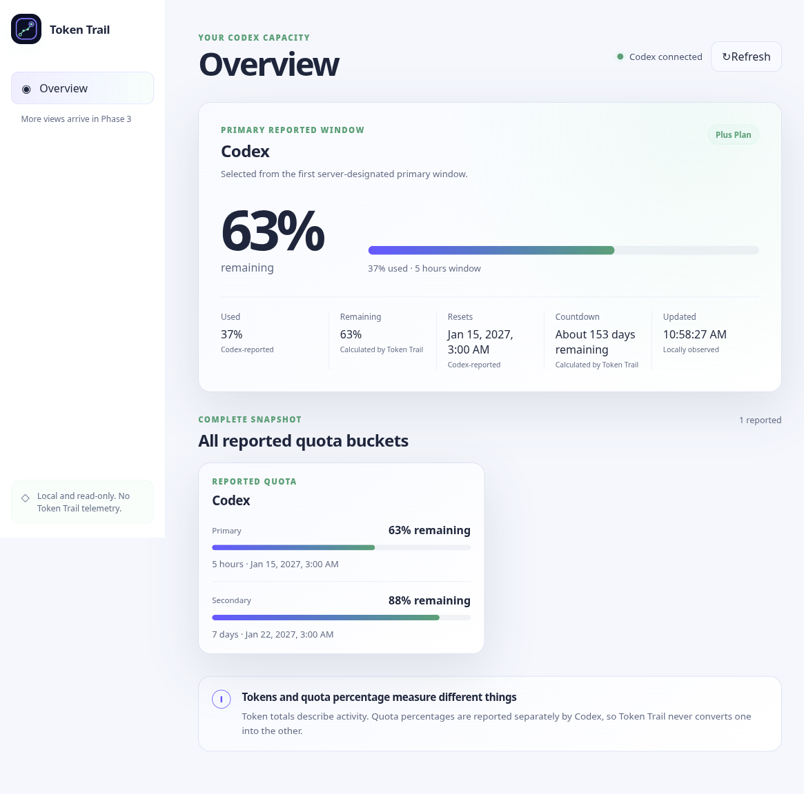
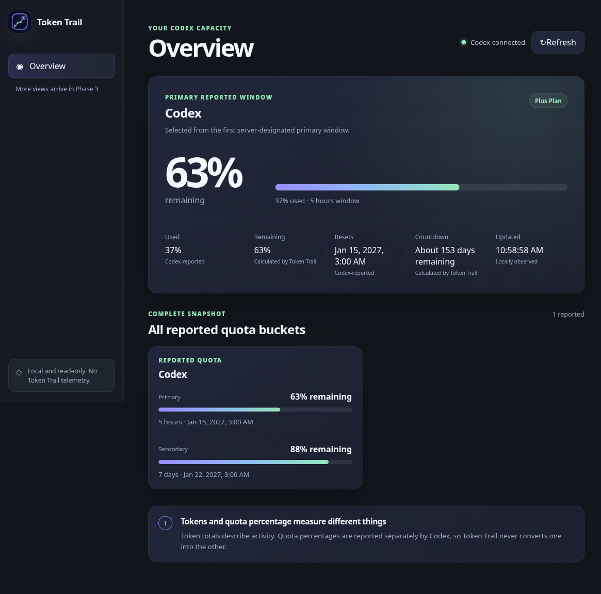
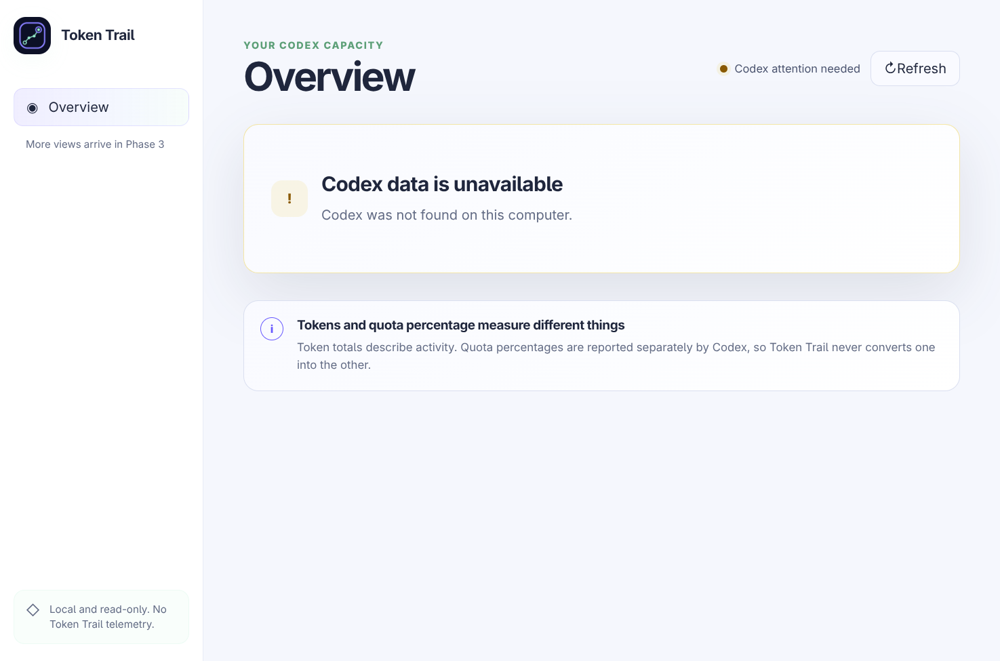

# Token Trail 0.2.0 Phase 2 Test Report

**Status:** Phase 2 complete locally; ready for review and commit
**Tested:** August 14, 2026, America/Toronto
**Source state:** Uncommitted Phase 2 working tree based on `4fba55e`
**Platform:** CachyOS Linux 7.1.8, x64, KDE Plasma Wayland  
**Release effect:** No GitHub Release was created or published

## 1. Recommendation

Phase 2 meets its vertical-slice exit criteria. The checked-in synthetic app-server drives account and quota data through an owned process, bounded validation, normalization, authenticated IPC, a frozen preload API, and the read-only Overview. Development and packaged styling are both verified, while production CSP remains strict.

This is a development milestone, not a v1 release recommendation. Phase 3 product routes, Phase 4 memory and desktop coverage, and Phase 5 release engineering remain open.

## 2. Implemented scope

- User-visible identity is **Token Trail**; machine-safe package, executable, protocol, and repository identifiers remain `tokentrail`.
- The new icon contains one trail mark and no duplicate top-left mark or embedded wordmark.
- Main owns a shell-free `codex app-server --stdio` process, allowlisted environment, correlation IDs, message limits, timeouts, cancellation, backoff, restart limits, and shutdown.
- Runtime schemas strip identifying email and unknown fields. Missing or invalid values remain unavailable rather than becoming zero.
- Renderer receives only normalized Overview DTOs through three frozen named bridge methods. It receives no raw IPC, Electron object, raw protocol payload, process detail, or raw exception.
- Overview covers never-started, loading, ready, partial, stale, signed-out, unsupported, unavailable, and error states.
- Primary quota shows reported used percentage, calculated remaining percentage, reported reset, calculated countdown, provenance, and local freshness. Every reported quota bucket remains visible.
- Automatic polling remains disabled pending measured need; a valid sparse rate-limit notification triggers a complete approved refresh.

## 3. Automated results

| Command | Result | Evidence |
| --- | --- | --- |
| `npm run typecheck` | Passed | Five strict TypeScript projects |
| `npm run test` | Passed | 13 files, 77 tests |
| `npm run test:integration` | Passed | 2 files, 13 tests; real fixture child processes |
| `npm run test:e2e` | Passed | 10 Electron tests |
| `npm run test:development` | Passed | 2 real Vite/Electron tests, including CSS HMR |
| `npm run test:security` | Passed | 3 production security tests |
| `npm run test:accessibility` | Passed | 2 tests, including 200% reflow |
| `npm run test:packaged` | Passed | 1 fused packaged-executable smoke/security test |
| `npm run test:performance` | Passed as measurement | 1 packaged measurement test |
| `npm run test:coverage` | Passed | 77 tests; 56.44% statements, 58.17% branches, 63.09% functions, 57.14% lines |
| `npm audit` | Passed | 0 known vulnerabilities at test time |

The first restricted integration invocation reported `spawnSync /usr/bin/node EPERM` because the workspace sandbox denied child creation. The identical suite passed after explicitly allowing its checked-in fixture process. This was an environment restriction, not a Token Trail test failure.

## 4. Fixture and state matrix

| Fixture | Expected behavior | Result |
| --- | --- | --- |
| `full` | Complete normalized Overview | Passed |
| `missing-account` | Signed-out guidance; no quota request | Passed |
| `single-bucket` | One complete bucket | Passed |
| `multiple-buckets` | All keyed buckets visible | Passed |
| `null-fields` | Partial state; no fabricated zeros | Passed |
| `unknown-fields` | Unknown data stripped; markup remains text | Passed |
| `malformed` | Sanitized invalid-response state | Passed |
| `oversized` | Message rejected within fixed byte limit | Passed |
| `method-not-found` | Unsupported compatibility state | Passed |
| `app-server-exit` | Sanitized unavailable state and owned cleanup | Passed |
| `timeout` | Bounded timeout and shutdown cancellation | Passed |

Controller tests additionally prove concurrent refresh deduplication, stale snapshot preservation, exponential backoff, restart budget, and recovery after cooldown. Exact IPC URL tests reject subframes, malformed URLs, lookalike hosts, alternate ports, non-root paths, queries, and fragments.

## 5. Security and privacy evidence

- Request methods are checked against a closed main-process allowlist before serialization. A deliberately widened denied method returns only `permission-denied`.
- Only `initialize`, `account/read`, `account/rateLimits/read`, and the separately approved future aggregate-usage read are in the request allowlist. Phase 2 does not call aggregate usage.
- The fixture includes `fixture@example.invalid`, an unknown `futureSecret`, and markup-shaped quota text. Email and unknown fields do not cross normalization; markup renders literally and creates no injected element.
- IPC accepts only the top-level `tokentrail://app/` document or exact `http://127.0.0.1:5173/` development document.
- The packaged renderer has no `require` or Node `process`, blocks remote top-level navigation and popups, and loads only the custom local protocol.
- Packaged production CSP rejects both inline `<style>` creation and inline style attributes. It contains no `unsafe-inline`, `unsafe-eval`, remote script, or wildcard source.
- Packaged testing replaces `PATH` and `HOME` with a disposable empty profile, so it cannot discover a real Codex installation or account.
- A privacy-safe read-only probe against installed `codex-cli 0.146.1` confirmed initialization, account read, rate-limit read, one bucket, and a primary window. The probe emitted only booleans/counts—no email, quota values, payload, stderr, token, or filesystem path.

## 6. Development CSP regression and correction

The Phase 1 development renderer was unstyled because Vite injects imported CSS into an inline `<style>` during development, while `style-src 'self'` rejects inline styles. Production extracts CSS into a self-hosted file and was unaffected.

Phase 2 now constructs policies separately. Development alone permits inline styles and the exact Vite HMR WebSocket on `127.0.0.1:5173`; production stays unchanged and strict. A test starts the same `scripts/dev.mjs` orchestration as `npm run dev`, asserts authored grid/font styles, changes and restores a real CSS token through HMR without restarting Electron, and checks for CSP console errors.

The first development harness launched through an npm wrapper. Terminating that wrapper did not reliably own all child processes and once left the exact test orchestrator on port 5173. The harness now starts `scripts/dev.mjs` directly, and that orchestrator owns and terminates its Vite/Electron children. Cleanup targets only the exact retained process.

## 7. Visual evidence

All values shown below come from synthetic fixtures or an isolated no-Codex package. No real account data appears in screenshots.

### Complete fixture Overview

Visual review: spaced product name, single-mark icon, Overview hierarchy, 63% calculated remaining, reset timestamp, countdown, freshness, both quota windows, and provenance are legible at 1180 × 780 CSS pixels.

### Real development Overview

Visual review: the real Vite path renders authored dark-theme layout and typography; it is no longer the Phase 1 browser-default view.

### Development unavailable state

### Packaged unavailable state

Visual review: development and packaged unavailable states use the same reviewed composition and naming. Their image pixel dimensions may differ with host device scale, while the test CSS viewport remains equivalent.

## 8. Performance and package observations

The exact measurement record is [metrics/phase-2-performance.json](metrics/phase-2-performance.json).

| Measurement | Observed |
| --- | ---: |
| Cold startup | 1,129.3 ms |
| Warm startup | 839.6 ms |
| Idle CPU | 0.19% |
| Resident memory, 7-process tree | 757.1 MB |
| Proportional memory, 7-process tree | 303.8 MB |
| Observation interval | 5.247 s |
| Main bundle | 87.00 kB, 24.48 kB gzip |
| Preload bundle | 66.17 kB, 18.01 kB gzip |
| Renderer JavaScript | 266.79 kB, 80.31 kB gzip |
| Renderer CSS | 8.33 kB, 2.46 kB gzip |
| Raster icon | 201.84 kB |

Startup and idle CPU are acceptable for this milestone. Memory remains above the provisional target and is an explicit Phase 4 profiling/optimization task; Phase 2 does not claim it passes a final memory budget.

## 9. Unavailable coverage and known limitations

- Not run here: GNOME, X11, arm64, clean-distribution, AppImage/deb/rpm/Pacman installation, suspend/resume, screen reader, multi-display, fractional scaling, and release CI. Their scheduled phases remain unchanged.
- Automatic periodic refresh is disabled pending evidence. Manual refresh and valid update-triggered full reads are implemented.
- Sparse notification content is not merged. It only triggers a new approved full read to avoid silently deleting fields across protocol versions.
- Usage, Credits, Learn, Settings/Diagnostics, historical calculations, and diagnostics export remain Phase 3.
- Final visual system/vector logo, memory work, broad Linux QA, and lifecycle soak remain Phase 4.
- GitHub Actions packaging, installer instructions, checksums, SBOM, and draft immutable Releases remain Phase 5.

## 10. Final disposition

No critical or high-severity Phase 2 defect remains open. Phase 2 is ready for the user's review and commit. Phase 3 must not be described as complete, and no release publication is authorized by this report.
