# Token Trail 0.3.0 Phase 3 Test Report

**Status:** Phase 3 complete locally; ready for review and commit
**Tested:** August 21, 2026, America/Toronto
**Evidence record finalized:** August 21, 2026 at 10:48 AM EDT (`America/Toronto`, UTC-04:00)
**Source state:** Uncommitted Phase 3 verification working tree based on `3667476`
**Platform:** CachyOS Linux 7.2.0-1-cachyos, x64, KDE Plasma Wayland
**Release effect:** No GitHub Release was created or published

## 1. Recommendation

**Preview-only.** Phase 3 meets its functional-scope exit criteria: every required v1 route, the shared domain library, validated preferences with live application, redacted diagnostics with sanitized health counters, the complete product-spec section 21.2 fixture catalog, runtime window identity, and the representative-value readability matrix are implemented and verified.

This is not a stable-release recommendation. Phase 4 (accessibility review, performance budgets, manual screen-reader evidence, Linux desktop matrix), Phase 5 (packaging formats, release engineering), and Phase 6 (release validation) remain open.

## 2. Scope tested and changes since 0.2.0

- Six-route product shell over the Phase 2 boundary (Overview, Quota Windows, Usage, Credits, Learn, Settings & Diagnostics).
- Shared dependency-free calculation library: exact bigint counters as canonical decimal strings, calendar-date semantics, statistics, complete-period comparisons, heatmap classification, coverage accounting, deterministic orderings, in-memory session deltas.
- Validated preferences persisted atomically with quarantine-on-corruption; **new in 0.3.0:** settings changes apply live through the shared hook updater.
- Redacted diagnostics document with preview-before-export and a new sanitized `health` section (bounded refresh counters, closed outcome category, coarsened duration bucket) recorded only in process memory.
- Contextual navigation: error states offer corrective actions; reached-state pills, capacity clauses, coverage notes, and session notes deep-link to reviewed Learn entries via validated `#learn/<entry-id>` hashes.
- Complete section 21.2 protocol fixture catalog executed through the real owned-process transport (16 checked-in scenarios plus the parameterized typography set).
- Runtime window icon verified independently from package metadata; numeric readability matrix (`11%`, `47%`, `48%`, `88%`, `100%`) captured across light/dark themes, 100/200 percent zoom, and the narrowest supported width.
- Architecture documentation expanded to implemented-system status with compact diagrams and an automated local-link/terminology gate (`npm run check:docs`).

## 3. Local and CI environments

| Property | Value |
| --- | --- |
| Operating system | CachyOS Linux, kernel 7.2.0-1-cachyos |
| Architecture | x64 |
| Desktop | KDE Plasma, Wayland session |
| Electron | 43.4.0 |
| Node (toolchain) | ≥ 24.15.0 per package engines |
| CI runs | None this phase; all evidence is local |

Unavailable environments recorded honestly: GNOME Wayland, X11 comparison, arm64 hardware, clean-distribution installs, and installer packages are not tested in this phase.

## 4. Artifact inventory

No distributable artifacts were built for release. Local build outputs used for testing:

| Output | Purpose | SHA-256 |
| --- | --- | --- |
| `dist/*` (main, preload, renderer bundles) | Built-app Electron tests | Not retained; regenerated per run |
| `release/linux-unpacked/` (AppImage target dir) | Packaged smoke, identity, performance tests | Not retained; regenerated per run |

Checksums apply to published release assets at Phase 6; no draft or published release exists for 0.3.0.

## 5. Exact commands and execution times

All executions ran locally on August 21, 2026 (`America/Toronto`, UTC-04:00).

| Command | Start | Finish | Result |
| --- | --- | --- | --- |
| `npm run verify` (format, lint, five type-check projects, unit/component, integration) | 10:39:21 AM EDT | 10:39:35 AM EDT | Passed |
| `npm run check:docs` | 10:39:35 AM EDT | — | Passed; 32 files scanned, 0 findings |
| Build + `npx playwright test tests/e2e tests/security tests/accessibility tests/development` | 10:39:49 AM EDT | 10:40:27 AM EDT | Passed; 27 tests |
| `npm run test:packaged` | 10:40:27 AM EDT | 10:40:33 AM EDT | Passed; 2 tests |
| `npm run test:performance` | 10:40:33 AM EDT | 10:40:50 AM EDT | Passed; 1 test |
| `npm run test:coverage` | 10:40:50 AM EDT | ~10:41:21 AM EDT | Passed |
| `npm audit` | 10:35 AM EDT (initial); re-run after echarts upgrade | — | 0 vulnerabilities after remediation |

Final post-remediation confirmation: `npm run verify` re-passed with 25 unit/component files (184 tests) and 3 integration files (30 tests) after the echarts 6.1.0 upgrade; Playwright e2e/security suites passed 23 tests together in one combined run.

## 6. Test-layer summary

| Layer | Command | Files | Tests | Result |
| --- | --- | --- | --- | --- |
| Unit + component | `npm run test` | 25 | 184 | Passed |
| Integration (real fixture processes) | `npm run test:integration` | 3 | 30 | Passed |
| Built Electron E2E | included in combined run | 6 specs | 19 | Passed |
| Security | included in combined run | 1 spec | 3 | Passed |
| Accessibility (automated) | included in combined run | 1 spec | 2 | Passed |
| Development orchestration | included in combined run | 1 spec | 2 | Passed |
| Packaged smoke + identity | `npm run test:packaged` | 1 spec | 2 | Passed |
| Performance measurement | `npm run test:performance` | 1 spec | 1 | Passed (measurement) |
| Documentation integrity | `npm run check:docs` | 32 docs | — | Passed |

Coverage (V8): 77.6% statements, 70.32% branches, 80.93% functions, 79.09% lines. Coverage supplements behavior evidence; untested remainder is concentrated in privileged wiring exercised through the real boundary layers above.

## 7. Fixture and state matrix (product-spec section 21.2)

Every required fixture was executed against the real transport, validation, and normalization pipeline; renderer presentation was additionally verified end to end where noted.

| Required fixture | Scenario(s) | Layer | Result |
| --- | --- | --- | --- |
| Full current response | `full` | Integration + E2E | Passed |
| No account | `missing-account` | Integration + E2E | Passed |
| One / multiple quota buckets | `single-bucket`, `multiple-buckets` | Integration + E2E | Passed |
| Primary only / secondary only / neither | `primary-only`, `secondary-only`, `no-windows` | Integration + E2E | Passed |
| Null timestamps and durations | `null-fields` | Integration + E2E | Passed |
| Unknown limit and plan values | `unknown-values` | Integration | Passed |
| Sparse update before / after full snapshot | `sparse-update-before-full`, `sparse-update-after-full` | Integration + E2E | Passed |
| Credits unavailable / unlimited / zero / decimal | default empty, `credits-unlimited`, `credits-zero-balance`, `credits-decimal-balance` | Integration (+ decimal E2E) | Passed |
| Reset-credit count without detail rows | `reset-credits-count-only` | Integration | Passed |
| Missing daily buckets and explicit zero buckets | `usage-gaps` | Integration + E2E | Passed |
| Integers beyond safe-number range | `usage-huge-counters` | Integration + E2E | Passed |
| Unknown nested fields | `unknown-fields` | Integration + E2E | Passed |
| Malformed JSON / duplicate IDs / huge arrays and strings | `malformed`, `duplicate-id`, `oversized` | Integration | Passed |
| Method-not-found / app-server exit | `method-not-found`, `app-server-exit` | Integration + E2E | Passed |
| Shared reset timestamps / missing resets | `shared-reset-timestamps` | Integration | Passed |
| Reached state beside high percentage without reached | `reached-state` | Integration + E2E | Passed |
| Session baseline, increase, reset transition, counter decrease, restart | Controller unit suite (`overview-controller.test.ts`) | Unit | Passed |
| Fourteen dates, one missing, one zero, duplicate date | `usage-gaps` | Integration | Passed |
| Sixty dates with zero preceding period | `usage-sixty-days-zero-preceding` | Integration | Passed |
| Odd/even medians, tied maxima, no active days, exact arithmetic | `usage-calculations.test.ts` | Unit | Passed |
| Reset credits inside/outside seven days, expired, non-expiring, unknown, capped details | `reset-credits-expiry-mix` + expiry unit suite | Integration + Unit | Passed |
| Combined capacity clauses with every metric unavailable | `combined-capacity.test.ts` | Unit | Passed |

## 8. Formula edge-case matrix (plan §7.8)

| Case family | Evidence | Result |
| --- | --- | --- |
| Boundary | Comparison span requirements; exactly-604,800-second expiry rule; one-day statistics collapse | Passed |
| Missing | Unavailable sections never become zeros; missing dates listed, never filled | Passed |
| Zero | Both-periods-zero comparison case; reported-zero heatmap cells distinct from missing; active-day average unavailable at all-zeros | Passed |
| Duplicate | Duplicate daily buckets rejected deterministically with counted rejection; duplicate response correlation IDs ignored | Passed |
| Invalid | Calendar keys, counter strings, and per-window fields rejected without coercion into neighbors | Passed |
| Reset | Session delta rebasing across reset transitions without negative usage display | Passed |
| Oversized | Beyond-safe-range integers stay exact as strings; transport byte/array/string limits reject hostile input | Passed |

## 9. Route, keyboard, and presentation verification

- **Keyboard-visible sweep:** a component test walks Tab focus to each navigation link and activates it with Enter across all six routes; a real-Electron E2E repeats the identical sweep on fixture data. Both pass.
- **Chart/table same source:** toggling Usage between chart and table preserves identical values from one normalized day list; the chart's accessible name names the same supplied-day count. Passed.
- **No unavailable-to-zero:** statistics render "Unavailable" rather than zero when no days exist; durations, remaining percentages, balances, and countdowns preserve explicit absence; E2E asserts zero fabricated `0 minutes` values on partial fixtures. Passed.
- **Clear-data scope:** store-level tests confirm removal of exactly Token Trail-owned preference files (including quarantined siblings) and defaults restoration; the renderer requires explicit two-step confirmation. Passed.
- **Contextual navigation:** capacity clauses link to Quota Windows/Credits detail; reached pills, coverage notes, session notes, and error panels deep-link to reviewed Learn entries; unknown deep-link identifiers fall back safely. Passed at component and E2E layers.

## 10. Identity and readability verification

- **Runtime window icon:** main-process evaluation inside the built app proves the window resolves an application-owned branding path that decodes to real pixel data (`tests/e2e/window-identity.spec.ts`). The packaged smoke suite additionally verifies the exact asset shipped inside `app.asar`. Development mode executes the identical window-construction code path.
- **Window-chrome capture limitation:** automated capture of native title-bar/taskbar chrome is not possible under the available KDE Wayland compositor through application-level APIs. This environment limitation is recorded here rather than presented as a pass; desktop-shell visual confirmation remains a Phase 4 manual item.
- **Typography matrix:** geometry assertions confirm tabular numerals, positive letter spacing, nowrap behavior, and no horizontal clipping for `11%`, `47%`, `48%`, `88%`, and `100%` in light and dark themes, at 100% and 200% zoom, at both 1180 px and the narrowest 720 px width. Twenty curated screenshots are embedded below.

## 11. Security and privacy verification

- Renderer isolation, popup/navigation denial, custom-scheme handling, and production CSP rejection of inline styles re-verified in built and packaged modes. Passed.
- Sender authorization now accepts approved documents **with any URL fragment** because fragments are client-side route state of the already-trusted document; subframes, lookalike hosts, alternate ports, non-root paths, and queries still fail closed. New unit cases cover fragment acceptance and combined path/query+fragment denial. Passed.
- Diagnostics canary scans confirm no seeded secrets, paths, emails, identifiers, prompts, tokens, or unknown fields enter the serialized document, including the new `health` section whose recorder observes only normalized snapshot transitions. Passed.
- Clear-data removes only Token Trail-owned files. Passed.
- `npm audit`: 0 known vulnerabilities after upgrading `echarts` from the pinned 6.0.0 to exact 6.1.0 within the same major version, remediating GHSA-fgmj-fm8m-jvvx (moderate). The advisory concerned tooltip/rich-text rendering; Token Trail renders chart data as numbers and protocol strings through React text nodes, but the pinned dependency was upgraded rather than explained away.

## 12. Defects found during this phase and their disposition

Integrity rule: initial failures and their remediation are recorded, never deleted.

| # | Defect | Discovery | Disposition |
| --- | --- | --- | --- |
| 1 | Every preferences/diagnostics/clear-data IPC call failed with "Denied Token Trail IPC sender" once hash navigation had changed the URL; the sender rule required an empty fragment. Latent since Phase 2 because no real-Electron test had ever invoked these handlers. | Theme matrix screenshots rendered light theme; console probe captured the rejection | Fixed by ignoring the fragment during sender authorization with rationale documented in code, architecture docs, and unit tests; regression added (`preferences.spec.ts`). |
| 2 | Settings selections persisted but did not apply live; the settings route shadowed the hook updater without adopting the stored result, so themes changed only after restart. | Dark-theme captures still light after clicking Dark | Fixed by routing saves through the shared hook that adopts the stored validated result; live-application E2E added. |
| 3 | `.remaining-value strong` overrode the display-number token with negative letter-spacing (-0.07em), squeezing dense digit pairs despite the token existing. | Geometry assertion measured -5.6px computed tracking | Fixed by deferring glyph spacing and line height to the `.display-number` token; matrix verifies positive tracking everywhere. |
| 4 | Built-app tests shared Electron's default user-data directory, so newly persisting preference writes leaked state across suites. | Foundation theme test began failing after defect 2 was fixed | Fixed with isolated disposable profile directories per launch sequence (`TOKENTRAIL_TEST_USER_DATA_DIR` seam, unpackaged only). |
| 5 | `npm audit` moderate advisory on echarts 6.0.0 | Routine audit before report finalization | Upgraded to exact 6.1.0; full suites re-run green. |

## 13. Accessibility verification

Automated checks pass: landmarks, single level-one headings per route, semantic tables/description lists, progress-bar value texts, keyboard-only operation of every primary workflow, visible focus indicators, and 200 percent-width reflow assertions from the earlier phase. Manual screen-reader campaigns, contrast audits, high-contrast observation, and reduced-motion manual verification are explicitly **not yet performed** and remain Phase 4 requirements. The automated layer is not claimed as conformance evidence beyond its scope.

## 14. Performance measurements

Recorded August 21, 2026 at 10:40 AM EDT from the fused unpacked package (`tests/test_reports/0.3.0/metrics/phase-3-performance.json`):

| Metric | Measured | Budget status |
| --- | --- | --- |
| Cold startup | 413.5 ms | Within Phase 1 observed envelope |
| Warm startup | 341.8 ms | Within Phase 1 observed envelope |
| Idle CPU after settling | 0.39% | Pass |
| Resident memory (process-tree sum) | 802.5 MB | Misses the provisional ceiling; carried openly to Phase 4 as planned |
| Proportional resident share | 302.6 MB | Recorded for context |
| Observed process count | 7 | Matches Chromium/Electron/GPU/utility structure plus the owned Codex child |

The provisional memory miss is the same open finding recorded since Phase 1; it is scheduled Phase 4 work with profiling and budget revision evidence, not silently accepted here.

## 15. Known limitations

1. Native window-chrome/desktop-shell icon capture unavailable under KDE Wayland automation (recorded, not waived).
2. GNOME, X11, arm64, fractional-scaling, clean-distribution, and installer-format coverage absent until Phases 4–6.
3. Manual screen-reader and contrast evidence pending (Phase 4).
4. Provisional memory ceiling missed; budget work scheduled (Phase 4).
5. Route changes do not yet move programmatic focus to the new heading (Phase 4 accessibility work); landmark navigation covers keyboard users today.
6. Automatic refresh remains disabled by default pending evidence; interval plumbing exists and is bounded.

## 16. Curated screenshots

Build: uncommitted working tree based on `3667476`; environment: CachyOS Linux x64, KDE Plasma Wayland, Electron 43.4.0. All screenshots use synthetic checked-in fixtures; none contain account data, private paths, or unrelated desktop content.

### Fixture-backed Overview (built app, dark system palette)

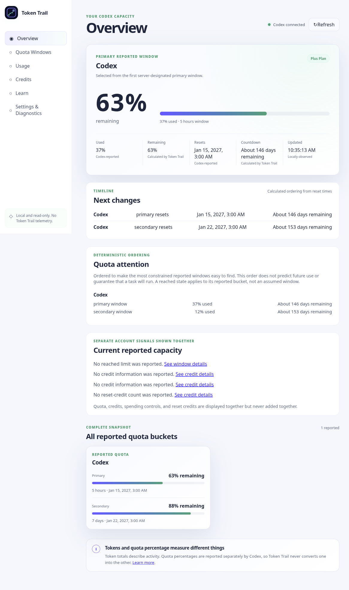

*Built-content Electron launch of scenario `full` at the default 1180×900 viewport, showing Codex connected state with calculated-by-Token Trail provenance.*

### Numeric readability matrix — light theme

| Remaining value | 100% zoom | 200% zoom |
| --- | --- | --- |
| 11% | 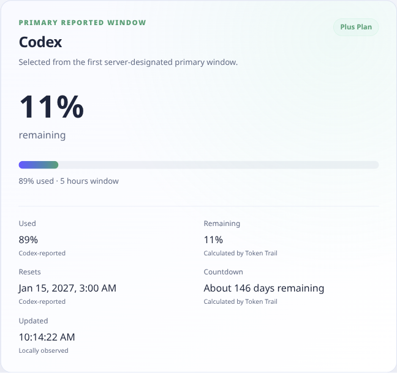 | 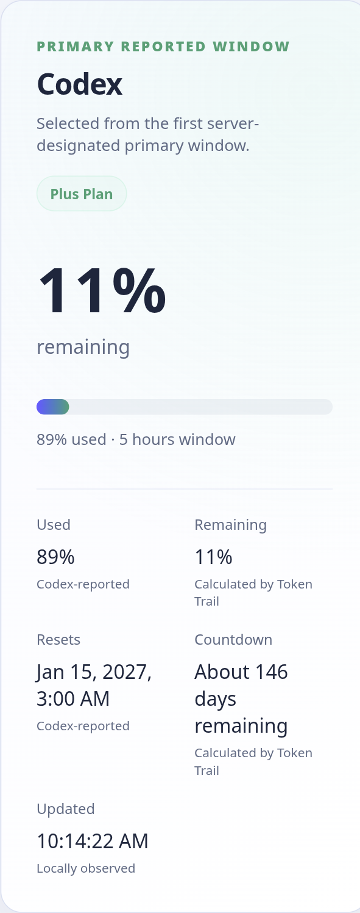 |
| 47% |  | 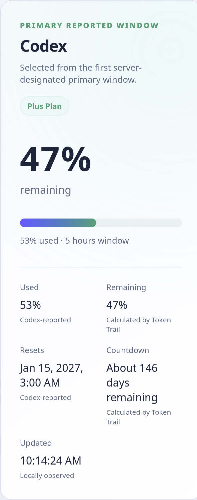 |
| 48% | 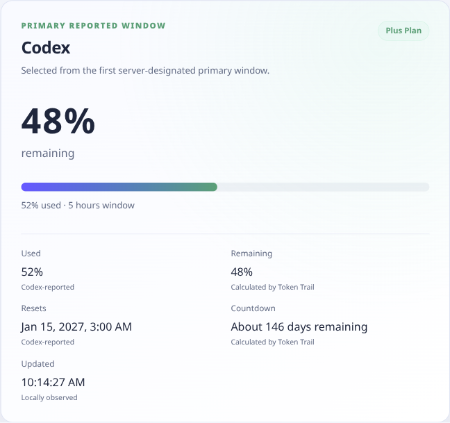 | 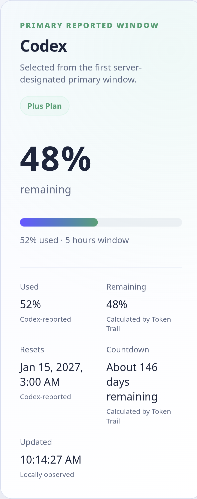 |
| 88% | 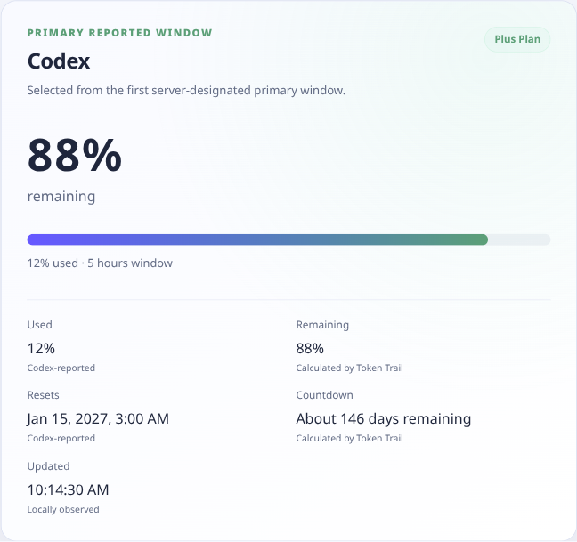 | 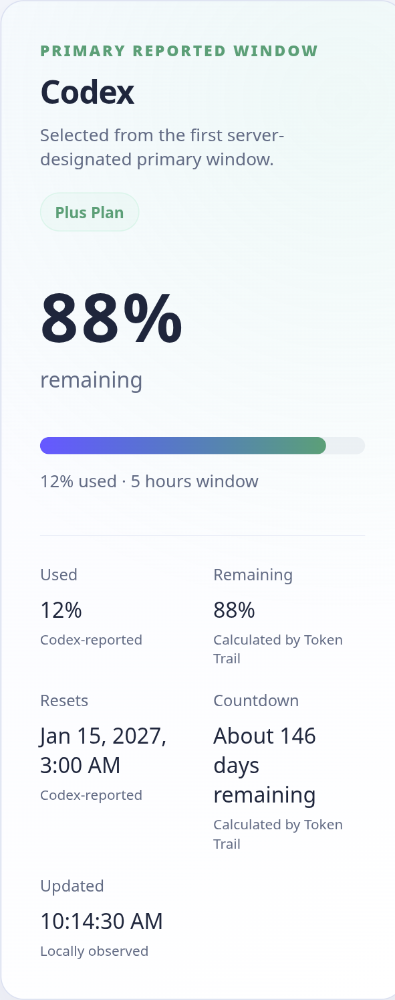 |
| 100% | 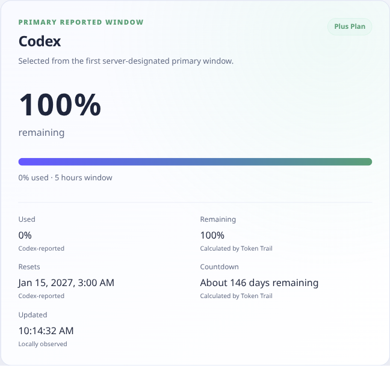 | 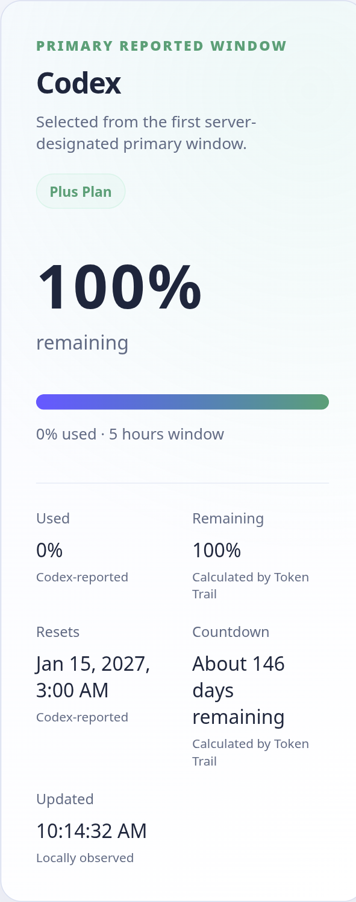 |

### Numeric readability matrix — dark theme

| Remaining value | 100% zoom | 200% zoom |
| --- | --- | --- |
| 11% | 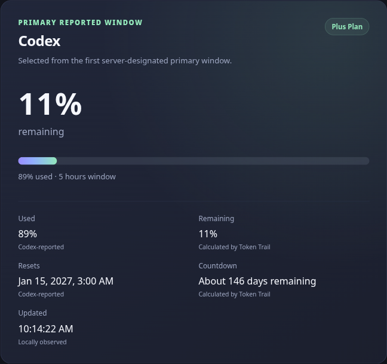 | 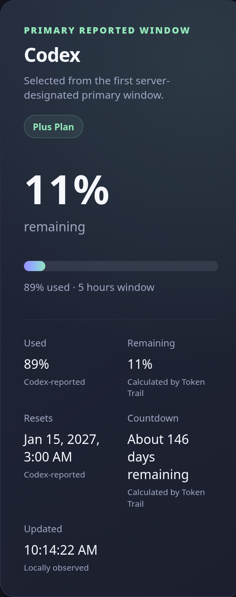 |
| 47% | 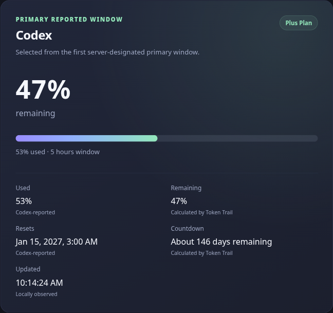 | 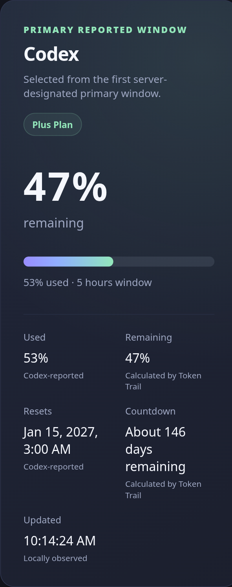 |
| 48% | 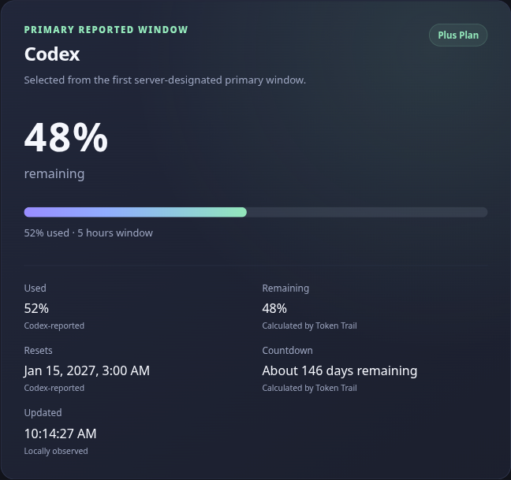 |  |
| 88% | 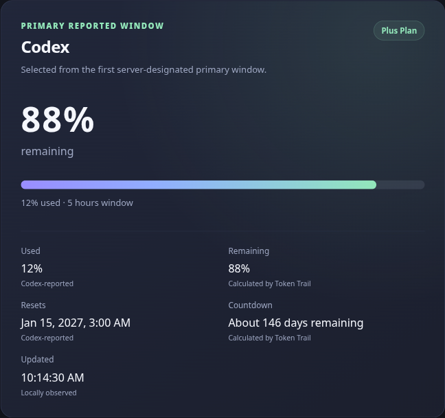 | 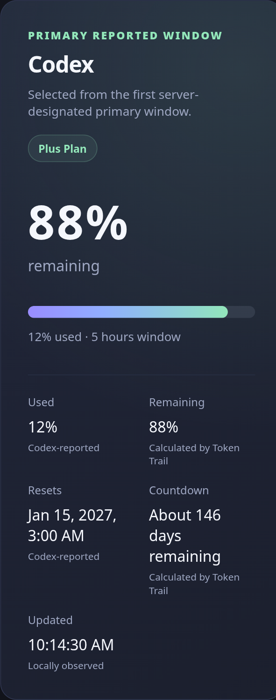 |
| 100% | 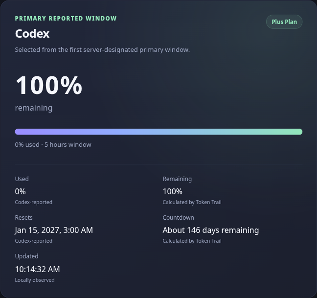 | 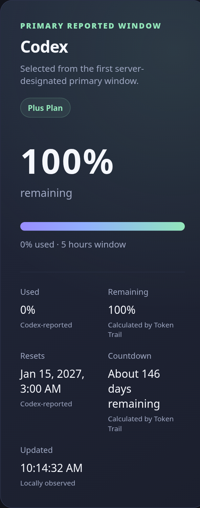 |

*Each capture shows the primary-card region at the narrowest supported 720 px width with the named theme applied through the real settings controls and zoom applied in the renderer. Digit pairs such as 48 and 88 remain visually distinct at every matrix position; the percent sign stays separated from the digits.*

## 17. Final recommendation and approver state

**Recommendation: preview-only**, reasons:

1. All Phase 3 functional exit criteria have implementation and automated coverage at appropriate layers, evidenced in this report.
2. Product-correctness rules are verified against the complete required fixture catalog through the real transport.
3. Security, privacy, diagnostics-canary, clear-data-scope, and sender-authorization gates pass in development, built, and packaged modes.
4. Stable-release blockers remain deliberately open: Phase 4 accessibility/performance/desktop evidence, Phase 5 packaging and release engineering, and Phase 6 validation are prerequisites to any `ready` recommendation.
5. No publication occurred; no tag exists; the version bump to 0.3.0 records this evidence point only.
