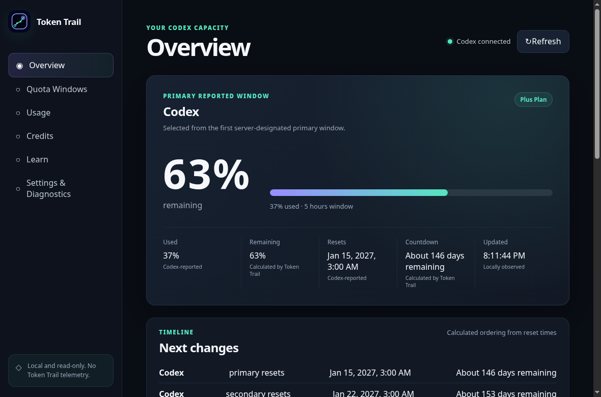
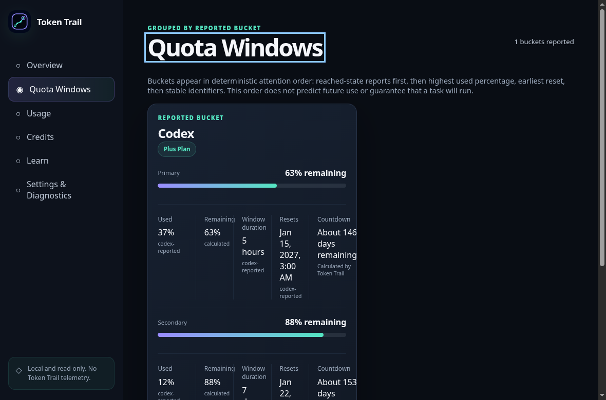
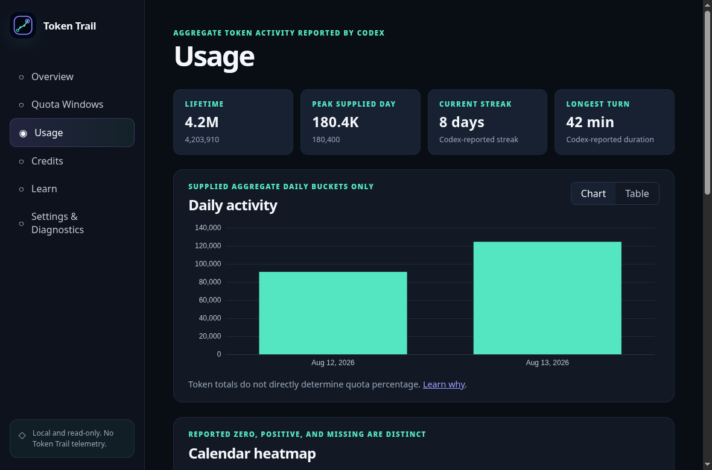
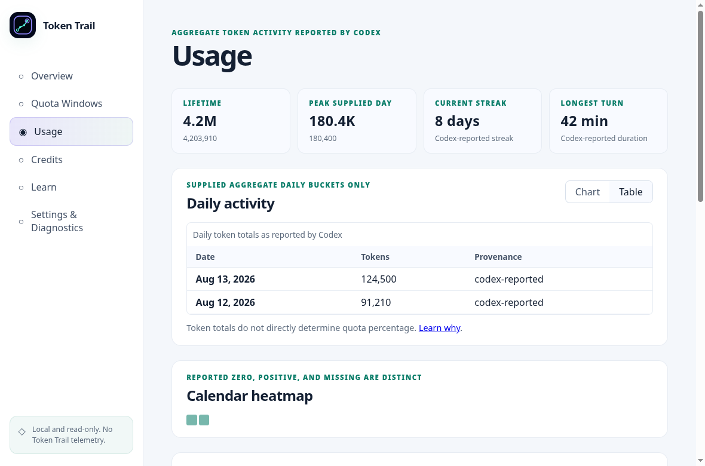
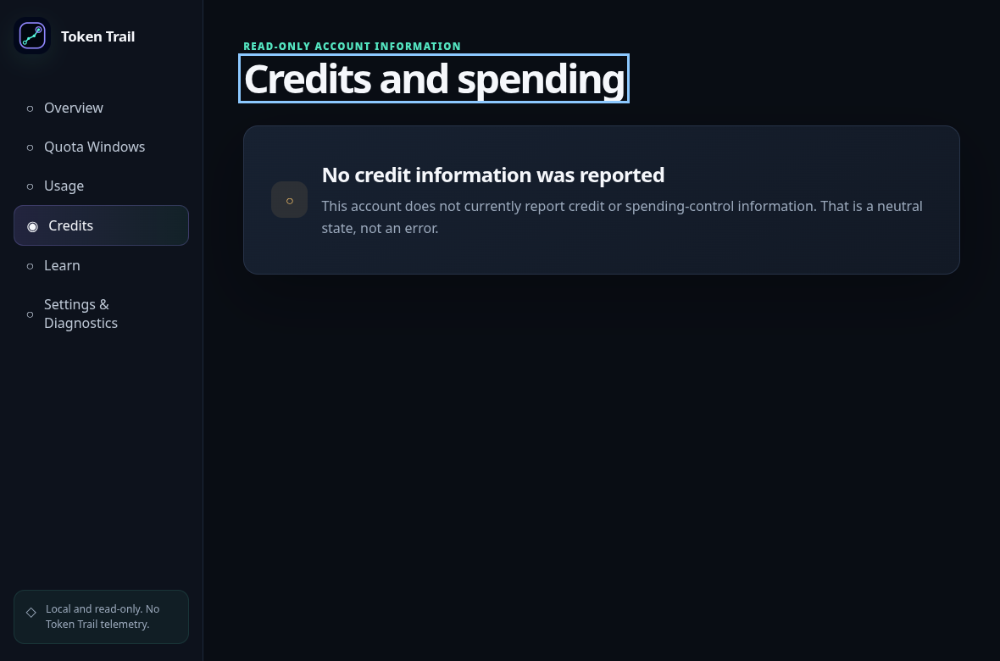
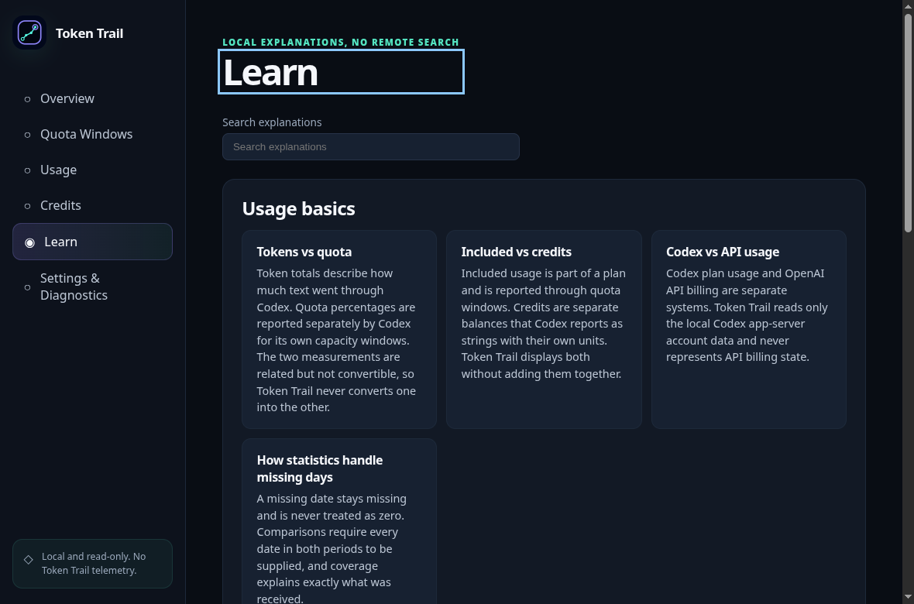
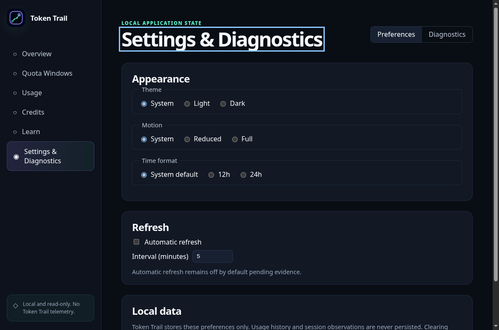
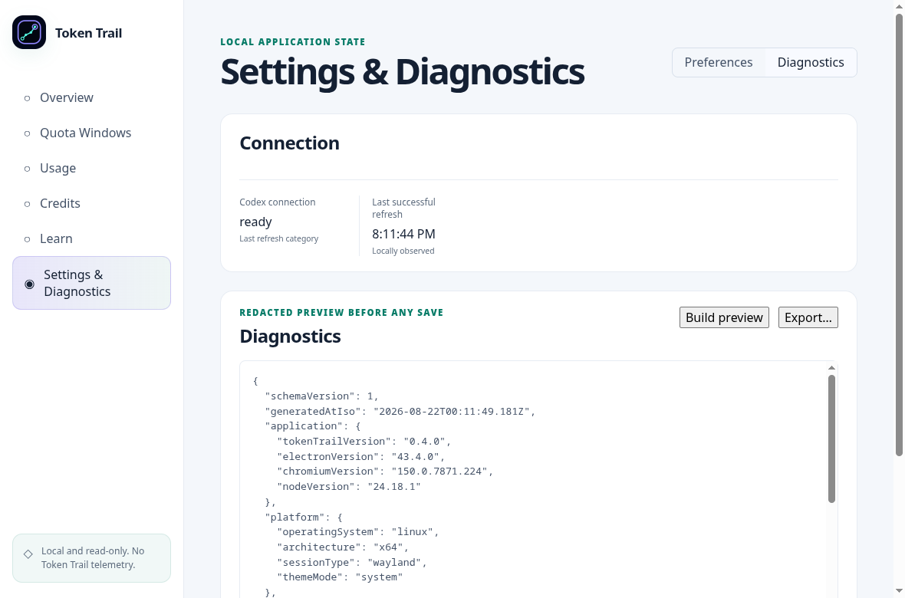

# Token Trail Test Report — 0.4.0

**Version:** 0.4.0 (working version; no release tag)
**Commit:** recorded at evidence finalization below (see tracker entries `95304e5` through the close-out commit)
**Tag:** none — this is a development-phase evidence record, not a release candidate
**Report status:** Complete for Phase 4 automated scope
**Release recommendation:** `preview-only`
**Human-readable evidence-finalization time:** August 21, 2026 at approximately 8:30 PM EDT (`America/Toronto`, UTC-04:00)

## 1. Scope tested and changes since 0.3.0

Phase 4 (Product quality) executed across seven areas:

1. Design-token layer with enforced contracts (`de3e336`).
2. Production vector identity with deterministic raster exports (`cc8a666`).
3. Font/icon licensing decisions and design-system architecture record (`ba98f23`).
4. Theme completion with WCAG contrast remediation and theme-aware tints (`d17a25a`).
5. Responsive width/zoom sweep (`5700f76`), chart token wiring with disabled animation (`de36e15`), and motion/idle-CPU contract (`f7c00b8`).
6. Accessibility campaign: keyboard-only workflow evidence plus skip link and clear-data adoption fix (`3d89ea8`), route-change focus management combined with the axe-core gate (`cac92fb`), assistive-technology observations (`9666a06`).
7. Resilience/lifecycle evidence and architecture record (`29a74a0`), performance budgets with lazy ECharts (`95304e5`), desktop identity across Wayland/X11 with the Wayland conduct guard (`7b47f47`).

## 2. Environments

- Development reference machine: KDE Plasma on Wayland, x64 Linux.
- Electron 43.4.0 (Chromium 150.0.7871.224), Node.js 24.18.1 per packaged diagnostics preview.
- X11 coverage exercised through XWayland via `ELECTRON_OZONE_PLATFORM_HINT=x11`.
- GNOME and other desktops: unavailable; not tested.

## 3. Commands and results

Exact wall-clock start/finish times were not captured per individual run during working sessions; runs occurred August 21, 2026 between approximately 5:00 PM and 8:20 PM EDT as recorded in `commit_tracker.md`. Counts below are from the final runs of each suite after all Phase 4 changes.

| Command | Result |
| --- | --- |
| `npm run verify` (format, lint, five-project typecheck, unit, integration) | Pass — unit 206 tests / 28 files; integration 32 tests / 3 files |
| `npm run build` (includes bundle-budget gate) | Pass — ceilings satisfied |
| `npx playwright test tests/e2e tests/accessibility` | Pass — 32 scenarios |
| `npm run test:packaged` | Pass — 4 scenarios including both display-server backends |
| `npm run test:performance` | Pass — all Phase 4 gates |
| `tests/e2e/performance-interactions.spec.ts` | Pass — timings within budgets |
| `npm run check:docs` / `npm audit --omit=dev` | 37 files clean / zero known vulnerabilities |

## 4. Summary by test layer

| Layer | Result |
| --- | --- |
| Unit (renderer contracts, tokens, domain, security helpers) | 206 passed |
| Integration (owned-process transport, fixture catalog) | 32 passed |
| End-to-end (built application) | 32 passed across navigation, workflows, resilience, timezone, interactions, typography, preferences, window identity |
| Packaged | 4 passed (hardened launch, ASAR icon, identity × 2 backends) |
| Performance | 1 passed scenario enforcing startup/CPU/memory gates |
| Bundle budget | Satisfied at build time on every build |

## 5. Failures encountered and remediations

Per integrity rules, defects hit during the phase are recorded with their resolution:

| Finding | Resolution |
| --- | --- |
| axe serious `scrollable-region-focusable` on diagnostics preview | Scrolling moved entirely to the already-focusable region; structural fix, no rule change |
| Latent clear-data defect: returned defaults ignored, stale visible settings until restart | Preferences hook gained an adoption path applied immediately after deletion; unit-covered |
| Latent runtime naming gap: packaged manifest lacked product name | `"productName": "Token Trail"` added beside the machine slug; asserted in ASAR content |
| Light-theme mint failed 4.5:1 text contrast (3.1–3.4:1) | Palette revised to `#087c68` (≥4.77:1); programmatic WCAG audit added |
| Leftover raw `16px` radius after token migration | Caught by new radius-discipline guard; converted to token |
| React effect anti-pattern (synchronous setState) in chart palette wiring | Reworked to render-time derivation with callback-only subscription |
| jsdom missing `matchMedia` crashed chart route suites | Subscription guarded; live scheme flips remain real-browser capability |
| Playwright strict-mode collision between nav and contextual links | Queries scoped to the navigation landmark with exact names |
| Keyboard sweep exhaustion after focus-management change | Sweeps restart tab order between legs, matching the new intended behavior |
| CSP correctly blocked inline axe injection | Audit switched to debugger-channel init script; shipped policy untouched |
| `/proc/<pid>/exe` read via `readFile` returned binary bytes | Switched to `readlink`; basename assertion corrected |

Two formatting-check failures were caught by the repository's own gates before commit and fixed without incident.

## 6. Security and privacy verification

- No write capability, prompt/task/repository access, credential handling, telemetry, network client, update check, or publication entered the codebase; the Codex allowlist is unchanged.
- The packaged CSP blocked inline script injection during axe integration exactly as designed; the audit uses the debugger channel available to test harnesses only.
- Wayland conduct guard now enforces no absolute window positioning, no stacking manipulation, no blur, and no unsolicited focus (single marked second-instance allowance).
- Diagnostics preview screenshots confirm redacted output (versions/platform/theme only).
- `npm audit --omit=dev`: zero known vulnerabilities; axe-core added as MPL-2.0 dev-only dependency.

## 7. Accessibility verification

- Keyboard-only completion of every primary workflow (end-to-end, built application): pass.
- Route-change focus management to content headings and Learn deep-link cards: pass.
- Skip-to-content link protecting deep-linked routes: pass.
- axe-core across nine scans (six routes, diagnostics with preview, two light-theme rescans): zero serious/critical violations.
- Assistive-technology observations: platform AX tree exposes named headings/controls/chart alternative; reduced-motion emulation renders spinner inert; forced-colors emulation keeps core controls present; countdown updates sit outside all live regions.
- Outstanding: human Orca screen-reader session (operator judgment; cannot be produced by automation).

## 8. Linux distribution, desktop, display-server matrix

| Environment | Status |
| --- | --- |
| KDE Plasma Wayland, x64 (reference machine) | All suites executed here |
| X11 via XWayland (ozone hint) | Packaged identity launches verified |
| Native X11 session | Untested (no bare-X11 session available) |
| GNOME Wayland; Cinnamon/Xfce | Untested (environments unavailable) |
| Fractional scaling beyond emulated zoom; multi-display | Deferred to soak/manual campaign |
| Installer formats (AppImage/deb/rpm/Pacman) | Deferred to Phase 5 verification |

See `docs/support/compatibility-and-support-matrix.md`.

## 9. Performance measurements versus budgets

Packaged (reference machine):

| Metric | Budget | Measured |
| --- | --- | --- |
| Cold / warm startup | ≤ 3,000 ms each | 410.6 / 401.5 ms |
| Idle CPU (5 s window) | ≤ 2 % | 0 % |
| Proportional set size | ≤ 450 MB | 333.2 MB |
| Resident set (informational ceiling, revised) | ≤ 1,000 MB | 863.9 MB |

Bundle: initial renderer JS 314,367 raw / 94,284 gzip bytes (budgets 350k/110k), chart chunk 512,458 (budget 560k), total 826,825 (budget 920k). First-paint JavaScript fell 62 percent after ECharts moved to a lazy route chunk.

Interactions (built, fixture data): chart-ready 339.1 ms (≤2,000), toggles 29.8/33.5 ms (≤500), refresh round trips 118.8→23.9 ms (≤5,000 each).

## 10. Installation results

Installer formats are not part of this phase. Unpacked-directory packaging was exercised repeatedly (hardened launch, ASAR contents, icon presence, dual-backend identity). Installation/upgrade/uninstall evidence is scheduled with Phase 5 artifacts and clean environments.

## 11. Known limitations and deferred identifiers

- Human Orca screen-reader session outstanding (operator work).
- Suspend/resume, display hot-plug, multi-day soak: Phase 6 campaign.
- Low-end hardware performance confirmation: Phase 6.
- GNOME/Cinnamon/Xfce sessions and native-X11: untested pending environments.
- Installed desktop-entry/AppStream verification: Phase 5.

## 12. Final recommendation

`preview-only` — Phase 4 quality work is complete and evidenced for every machine-verifiable criterion; remaining open items are explicitly human or environment-bound and are tracked in the plan and this report. Nothing here publishes or releases anything.

## 13. Evidence screenshots

Captured August 21, 2026 from the built application running the full checked-in fixture scenario; all values are synthetic fixture data.

