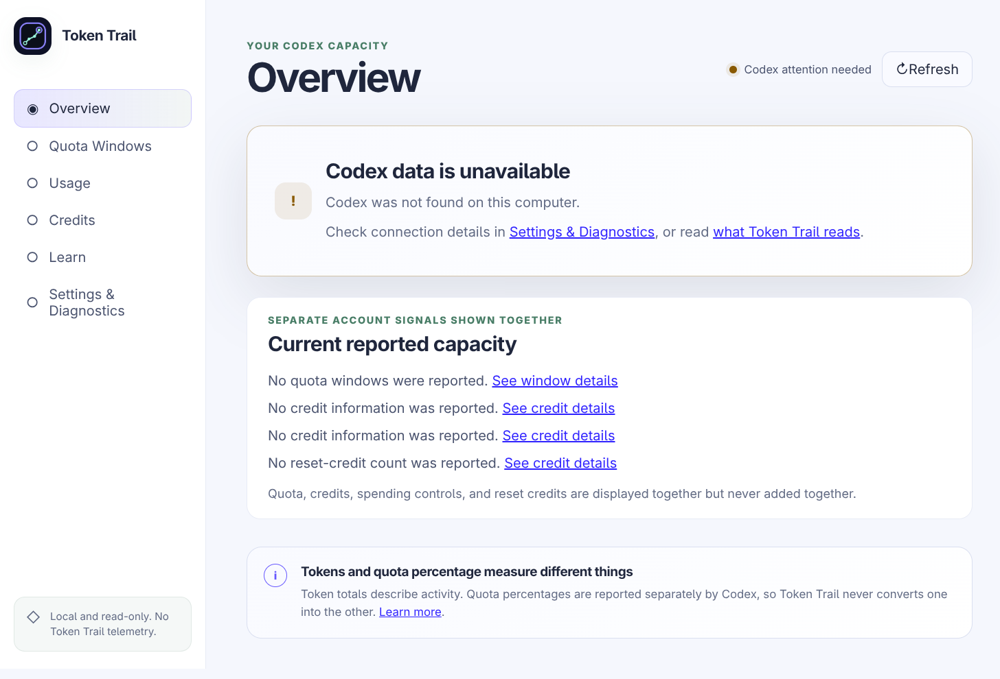

# Token Trail Test Report — 0.5.0

**Version:** 0.5.0 (working version; no release tag yet)
**Commit:** recorded at evidence finalization below (see tracker entries `23dddba` through the close-out commit)
**Tag:** none — this is a development-phase evidence record, not a release candidate
**Report status:** Complete for Phase 5 automated scope
**Release recommendation:** `preview-only`
**Human-readable evidence-finalization time:** August 22, 2026 at approximately 1:25 AM EDT (`America/Toronto`, UTC-04:00)

## 1. Scope tested and changes since 0.4.0

Phase 5 (Packaging and release engineering) executed across five areas:

1. Four-format packaging configuration with contract tests and machine-safe artifact names (`23dddba`), including the desktop window-association fix (`desktopName` + `syncDesktopName`) verified inside built payloads.
2. AppStream metainfo shipped into deb/rpm/Pacman payloads; packaged-contents inspection gate added.
3. Least-privilege CI and tag-driven draft-release workflows with SHA-pinned actions, protected-environment declarations, per-build provenance, and lockfile-sourced SBOM (`a9e9c36`); first shared-runner CI run green.
4. Six user guides plus README refresh (`6996bc2`).
5. Five architecture records for the release-engineering system (`3343e64`), clean-clone git-flow proof, dependency audit, SBOM inspection, and AppImage reference-machine launch evidence.

## 2. Environments

- Development reference machine: KDE Plasma on Wayland (Kernel 7.2.0-1-cachyos), x64 Linux; Node.js v24.18.1, npm 12.0.2.
- Shared runners: `ubuntu-24.04`, Node 24 with manifest-pinned npm 12.0.2, Xvfb for Electron suites (CI run 32549322828).
- rpm assembly tooling intentionally absent locally per operator decision; rpm evidence is CI-bound.

## 3. Commands and results

Exact wall-clock start/finish times were not captured per run during the working session; runs occurred August 21–22, 2026 between approximately 10:30 PM and 1:20 AM EDT as recorded in `commit_tracker.md`.

| Command | Result |
| --- | --- |
| `npm run verify` | Pass — format, lint, five-project typecheck, unit 220 tests / 29 files, integration 32 tests / 3 files |
| `npm run verify` (clean clone of `3343e64` in `/tmp`) | Pass — identical counts; proves the from-git flow end to end |
| `npm run build` | Pass — bundle-budget gate satisfied |
| `npx playwright test tests/packaged` | Pass — 4 scenarios on final runs (see §7 for two transient failures) |
| `npm run package:linux` (x64 subset) / separate `--arm64` builds | Pass — six artifacts produced |
| `npm run check:package-contents` | Pass — ASAR listing parsed; 6 artifacts scanned; no findings |
| `npm audit --omit=dev` | Zero known vulnerabilities |
| `npm sbom` + inspection | CycloneDX document, 487 components, permissive license set |
| `npm run check:docs` | 50 files scanned, zero broken links |

## 4. Artifact inventory

Built locally from commit `3343e64` state:

| Artifact | Size | SHA-256 (prefix) |
| --- | --- | --- |
| `tokentrail-0.5.0-linux-x86_64.AppImage` | 122 MB | `21931148…` |
| `tokentrail-0.5.0-linux-arm64.AppImage` | 121 MB | `037d1b16…` |
| `tokentrail-0.5.0-linux-amd64.deb` | 96 MB | `57d460cc…` |
| `tokentrail-0.5.0-linux-arm64.deb` | 90 MB | `4a24c7f0…` |
| `tokentrail-0.5.0-linux-x64.pacman` | 87 MB | `92ad26fb…` |
| `tokentrail-0.5.0-linux-aarch64.pacman` | 81 MB | `d3aaced1…` |

rpm artifacts were not assembled locally (operator decision recorded); they build in the release pipeline where Ubuntu provides `rpmbuild`.

## 5. Summary by test layer

| Layer | Result |
| --- | --- |
| Unit (packaging contract, tokens, domain, security helpers) | 220 passed |
| Integration (owned-process transport, fixture catalog) | 32 passed |
| Packaged | 4 passed (hardened launch, icon-in-ASAR, identity × 2 backends) |
| CI shared runners | Quality + built-security jobs green |
| Packaging gates | Contents inspection pass; budget gate pass at build time |

## 6. Security and privacy verification

- Payload allowlist, fuse posture, and ASAR-only loading are pinned by unit contract tests and exercised by packaged suites on both display-server backends.
- The contents gate parses the real ASAR header (not substring matching), rejects development paths, enforces the exact unpacked-entry allowlist including Electron license artifacts, and scans every artifact for credential-shaped markers.
- Release workflow requests read-only permissions except the single draft-creation step; untrusted pull requests receive no release capability; third-party actions pinned to API-verified commit SHAs.
- The maintainer email appears only where native packages require an accountable identity; it is already public in repository history.

## 7. Failures encountered and remediations

Per integrity rules:

| Finding | Resolution |
| --- | --- |
| `@typescript-eslint/no-require-imports` error on the CJS builder config | Narrow ESLint override scoped to that one file with rationale; CommonJS is electron-builder's loading contract |
| Provenance script's first local execution crashed on a missing `readFile` import | Fixed; second execution hashed all six artifacts correctly |
| Contents gate failed its own first run: allowlist omitted Electron's license artifacts it simultaneously required | Gate corrected before any release use — it caught its author's mistake as designed |
| Two transient 30-second timeouts in the packaged hardened-launch test (~01:07–01:10), UI fully rendered, unreproducible afterward (five consecutive green runs) | Recorded as an environment-transient under post-build system load; harness hardened so any recurrence self-reports the live URL instead of timing out opaquely. Retry behavior understood; cause not provable from retained traces (cleared by the green rerun). Follow-up stays visible here rather than being silently closed. |

## 8. Accessibility verification

No renderer behavior changed this phase; the Phase 4 accessibility record remains current. The packaged security suite re-verified isolation, and CI re-ran the built-application suites. The human Orca session from the Phase 4 report remains outstanding operator work and carries forward unchanged.

## 9. Linux distribution, desktop, display-server matrix updates

| Item | Status |
| --- | --- |
| Clean-clone git flow (`clone → npm ci → verify → build`) | Verified on reference machine at `3343e64`; mirrored by CI's frozen install |
| AppImage launch on reference desktop (KDE Plasma Wayland) | Verified: process stable, clean SIGTERM exit, benign Wayland/GPU warnings only |
| Installed-package verification (deb/rpm/Pacman installs, upgrades, uninstall) | Not executed locally; requires matching distributions — scheduled with clean-environment campaign |
| rpm artifact assembly | CI-bound by operator decision; Ubuntu runners provide `rpmbuild` |

See `docs/support/compatibility-and-support-matrix.md` (updated alongside this report).

## 10. Performance measurements versus budgets

Bundle budgets unchanged and enforced at every build: initial renderer JS 314,367 raw / 94,284 gzip bytes (budgets 350k/110k), chart chunk 512,458 (budget 560k), total 826,825 (budget 920k). No runtime-performance claims are made this phase beyond CI-green status; packaged startup/CPU/memory budgets carry forward from the 0.4.0 record until the next measurement campaign.

## 11. Installation results

Installer formats were exercised to payload level: deb control fields, Pacman `.PKGINFO`, and the extracted AppImage entry were inspected directly and matched the documented model (install locations, dependency sets, desktop identity). Executed install/launch/upgrade/uninstall cycles in clean environments remain scheduled work named in section 9.6.

## 12. Known limitations and deferred identifiers

- Local rpm assembly skipped (operator decision); rpm pipeline steps execute only on runners.
- Protected `release` environment required reviewers and tag immutability are operator settings pending completion before any candidate tag.
- The packaged-launch transient (§7) keeps a visible follow-up; its diagnostic hook will localize any recurrence.
- Human Orca screen-reader session outstanding (operator judgment; carried from Phase 4).
- GNOME/Cinnamon/Xfce sessions, native X11, fractional scaling, multi-display, soak items: carried from Phase 4 / Phase 6 campaigns.

## 13. Final recommendation

`preview-only` — Phase 5 automation and documentation are complete and evidenced at the machine-verifiable level; remaining open items are explicitly operator-held or environment-bound and stay visible above. Nothing here publishes or releases anything.

## 14. Evidence screenshots

Captured August 22, 2026 from the packaged application launching with an isolated profile; values show honest unavailable states (no fixture data in packaged mode).

## 15. Addendum — tag-driven pipeline proof (August 22, 2026)

Recorded after this report's finalization, per integrity rules that failures and remediations stay visible:

| Candidate | Run | Outcome |
| --- | --- | --- |
| `v0.5.0` | 32554394985 | Failed fast: build jobs lacked the bundle-build step; electron-builder attempted implicit tag publishing; SBOM job wrote into a nonexistent directory. Zero release objects created. Fixed in `af03499`. |
| `v0.5.1` | 32554726866 | Failed at the Pacman target: fpm requires `bsdtar` (Ubuntu package `libarchive-tools`). AppImage and deb built on runners; zero release objects created. Fixed in `c052fd2`. |
| `v0.5.2` | 32555040028 | All builds green including both rpm architectures; draft assembly failed because `gh` had no git context in an artifact-only job. Zero release objects created. Fixed in `515f806`. |
| `v0.5.3` | 32555728767 | **Success.** One draft prerelease containing exactly: eight artifacts (`x86_64`/`arm64` AppImage, `amd64`/`arm64` deb, `x86_64`/`aarch64` rpm and Pacman), merged `SHA256SUMS.txt`, two provenance records, and the CycloneDX SBOM. |

Checksum verification from the real draft location: `SHA256SUMS.txt` plus sampled artifact downloaded via `gh release download`; `sha256sum -c --ignore-missing` reported OK. The draft remains maintainer-only and unpublished.

The recommendation stands at `preview-only`; this addendum upgrades section 10's installation evidence from "CI-bound" to "runner-proven builds with payload-level inspection," while executed install campaigns remain owed by section 9.6.
